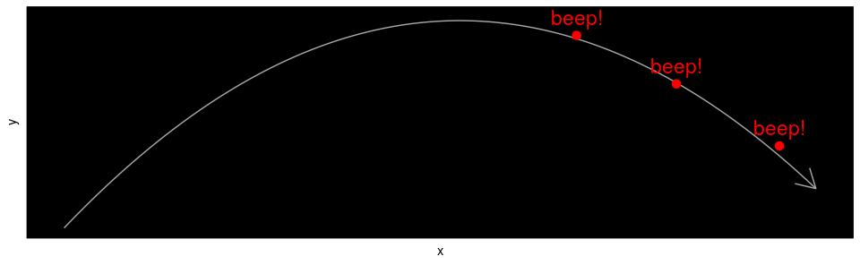
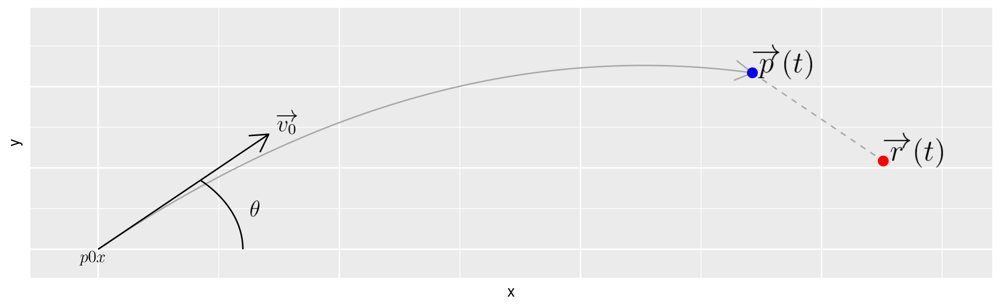
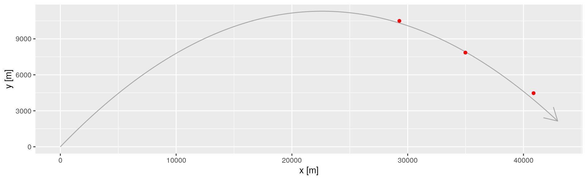
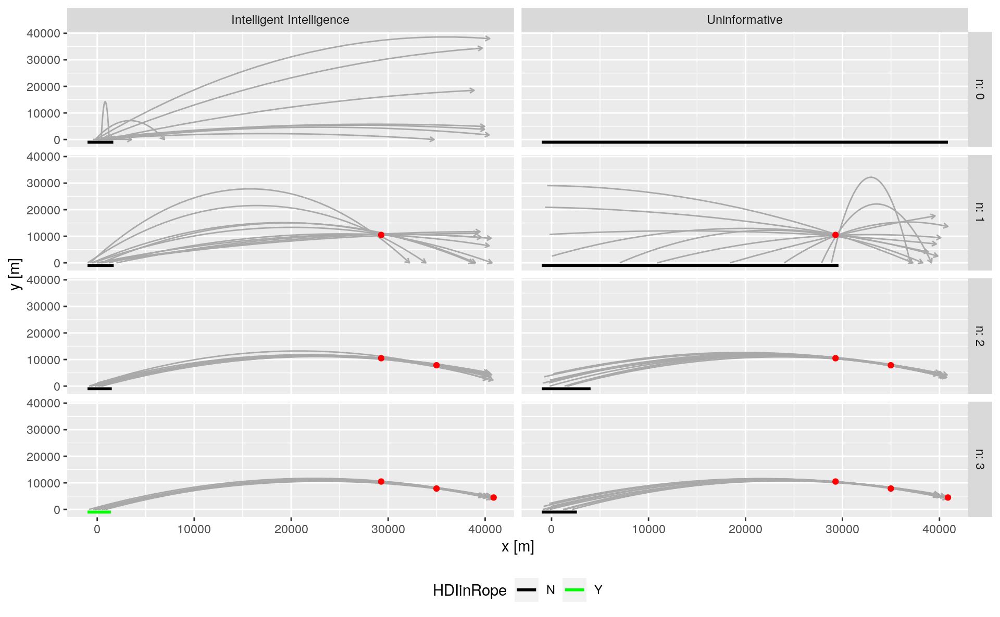
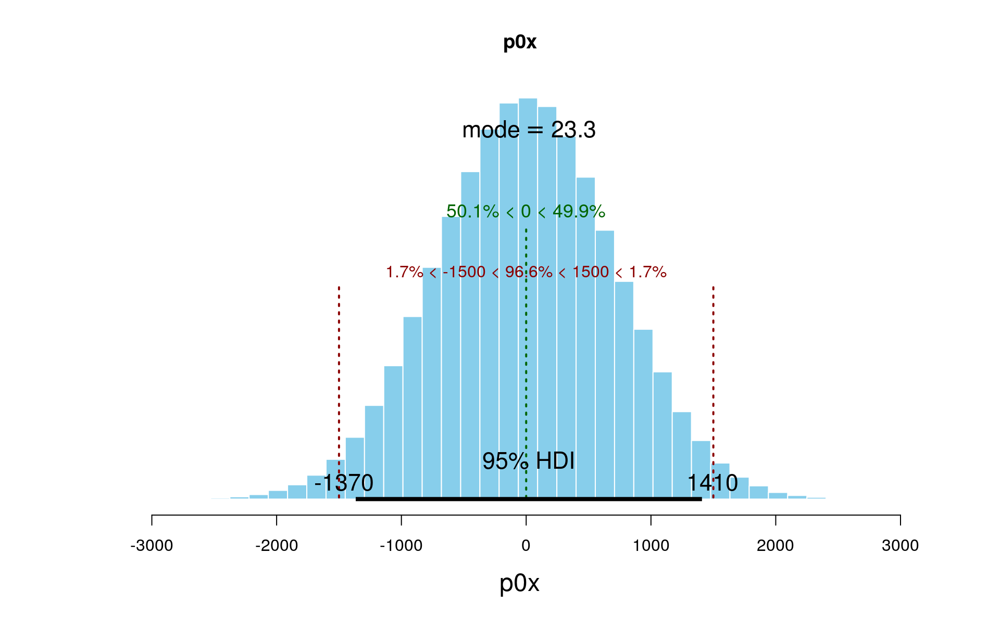

*This is a short summary only; the full study is available at:*   
*https://github.com/alberto-dellera/bayesian_artillery/blob/master/root/full_study/bayesian_artillery.pdf*

A battery is shooting at us, and all we have are some noisy radar
readings about the projectile trajectory:



we want to find the battery position, also factoring in some prior
knowledge provided by our Intelligence.

We will perform a standard Bayesian analysis (model building, MCMC by JAGS, chains exploration, etc), but from the practical perspective of the physical (mechanical) domain expert that wants to understand how the algorithm "reasons" about trajectories, projectile speed, etc etc.

We will build the physical model:



for which we will write a simulator in R, and produce a realization with three radar readins:




Then, we will construct a JAGS (BUGS) model:

``` r
jagsModel <- "
model {
  for ( i in 1:N ) {
    ## radar readings (likelihood)
    rx[i] ~ dnorm( px[i], 1/readings.error.sd^2 )
    ry[i] ~ dnorm( py[i], 1/readings.error.sd^2 )
    
    ## positions 
    px[i] <- p0x + v0x * (t[i] - t0)
    py[i] <-   0 + v0y * (t[i] - t0) - 0.5 * g * (t[i] - t0)^2
  }
  
  ## v0 components
  v0x <- v0 * cos(theta)
  v0y <- v0 * sin(theta)
    
  # priors   
  p0x   ~ dnorm( priorP0xMean, 1/priorP0xSd^2 ) # see discussion
  v0    ~ dunif( 1 * 330, 3 * 330 )  # between MACH1 and MACH3
  theta ~ dunif( 0, pi/2 )           # aiming above ground and not backwards
  t0    ~ dunif( t[1] - 1000, t[1] ) # at most 1000 seconds before first radar reading time
}
" 
```

And then we will explore *in great detail* how the Bayesian system incrementally improves its estimation as soon as a new radar reading enters the system:



And finish off with a souvenir photo of the battery position posterior:



Of course we will also inspect the standard diagnostics about the chains convergence.

*https://github.com/alberto-dellera/bayesian_artillery/blob/master/root/full_study/bayesian_artillery.pdf*


